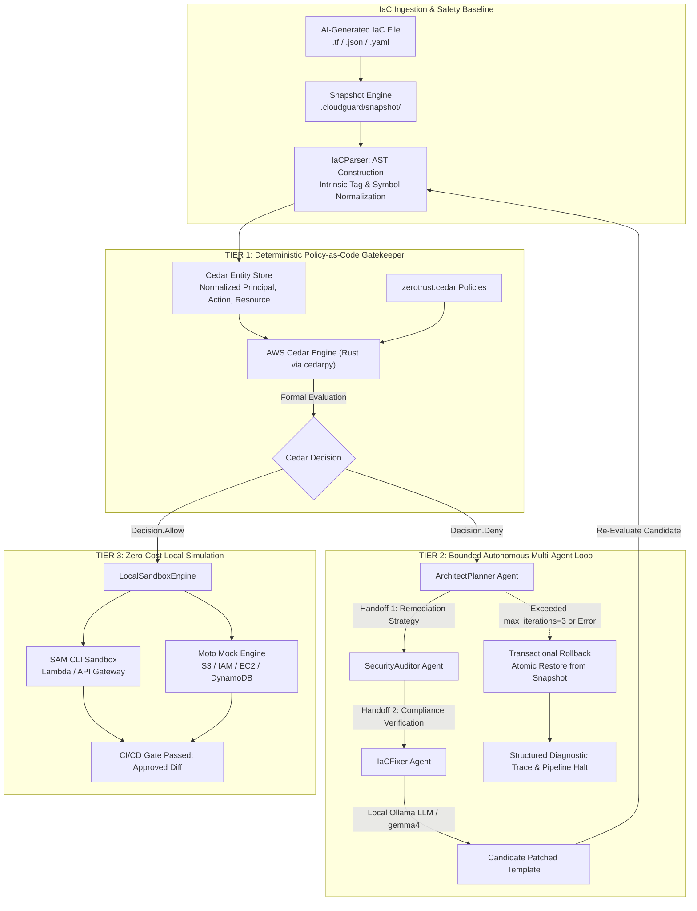

# 🛡️ CloudSentinel

> **Autonomous Local-First Zero-Trust Security Gatekeeper for AI-Generated Infrastructure-as-Code**  
> *AWS Hackathon — Bharat Builds Tour Submission*  
> **Built with**: AWS Cedar (`cedarpy`), AWS Strands SDK Pattern, Ollama (`gemma4:latest`), Moto, and AWS SAM CLI.

[](https://www.python.org/downloads/)
[-orange.svg)](https://www.cedarpolicy.com/)
[](https://ollama.com/)
[-brightgreen.svg)]()
[]()

---

## 📌 Executive Summary & Core Value Proposition

Generative AI is revolutionizing DevOps by synthesizing Infrastructure-as-Code (Terraform, CloudFormation, AWS SAM) in seconds. However, AI code generation introduces acute security risks: LLMs routinely hallucinate wildcard IAM permissions (`AdministratorAccess`, `"Action": "*"`), expose public S3 buckets, and create open `0.0.0.0/0` security groups.

**CloudSentinel** is a local-first CLI utility and CI/CD security gatekeeper engineered specifically to intercept, evaluate, and autonomously repair AI-generated IaC *before* it touches live AWS environments.

```
┌──────────────────────────────────────────────────────────────────────────────────┐
│                             THE CLOUDSENTINEL TRIAD                              │
├──────────────────────┬─────────────────────────────┬─────────────────────────────┤
│ 💸 TRUE ZERO         │ 🔒 DETERMINISTIC            │ 🔁 BOUNDED                  │
│    BILLING RISK      │    GUARDRAILS               │    REMEDIATION              │
│                      │                             │                             │
│ 100% local sandbox   │ AWS Cedar formal logic      │ Multi-agent Strands loop    │
│ using Moto & SAM     │ engine via Rust bindings    │ capped at max 3 iterations; │
│ CLI with local       │ (cedarpy). Fail-closed      │ atomic .cloudguard snapshot │
│ Ollama inference.    │ static authorization.       │ rollback on non-convergence.│
└──────────────────────┴─────────────────────────────┴─────────────────────────────┘
```

### Key Pillars:
1. **True Zero Billing Risk**: Executes exclusively on localhost. Serverless resources route to SAM CLI (`sam validate` / local invoke), while all other simulated cloud resources route to Moto. Outbound network calls to `*.amazonaws.com` are blocked by an active security interceptor.
2. **Deterministic Guardrails (Policy-as-Code)**: Static analysis uses **AWS Cedar**, AWS's formally verified authorization policy language. Policies enforce least-privilege IAM, S3 encryption and public access blocks, and closed perimeter ingress.
3. **Bounded Autonomous Remediation**: Employs an AWS Strands SDK-inspired multi-agent loop powered locally by Ollama. A strict bounded execution window (`max_iterations = 3`, `max_handoffs = 3`) prevents infinite repair loops.
4. **Transactional Safety Engine**: Pre-processor creates a SHA-256 snapshot in `.cloudguard/snapshot/`. If convergence fails or limits are exceeded, a clean filesystem rollback is automatically triggered.

---

## 🏛️ Architecture & Dual-Tier Workflow

CloudSentinel decouples **formal verification** from **stochastic agentic reasoning** through a resilient two-tier architecture:



### 🔹 Tier 1: AST Normalization & Formal Cedar Evaluation
- **AST Generation ([`parser.py`](file:///Users/soumyasagar/AWS%20hackathon/cloudsentinel/security/parser.py))**: Ingests raw CloudFormation, AWS SAM, or Terraform definitions. A custom PyYAML loader handles intrinsic tags (`!Ref`, `!Sub`, `!GetAtt`, `!Join`). Resources are converted into a strongly typed **Cedar Entity Store**.
- **Formal Verification ([`evaluator.py`](file:///Users/soumyasagar/AWS%20hackathon/cloudsentinel/security/evaluator.py))**: Evaluates entities against zero-trust Cedar policies ([`zerotrust.cedar`](file:///Users/soumyasagar/AWS%20hackathon/cloudsentinel/security/policies/zerotrust.cedar)). Evaluation is performed in compiled Rust via `cedarpy.is_authorized`. If any rule forbids deployment, the system triggers a **fail-closed** halt in `< 4ms`.

### 🔹 Tier 2: Bounded Multi-Agent Autonomous Loop
When Tier 1 denies deployment, CloudSentinel triggers the Strands multi-agent loop ([`strands_loop.py`](file:///Users/soumyasagar/AWS%20hackathon/cloudsentinel/agents/strands_loop.py)) powered locally by Ollama (`gemma4:latest`):
1. **ArchitectPlanner**: Diagnoses structured Cedar diagnostic violations and outlines an architectural fix that preserves business logic.
2. **SecurityAuditor**: Reviews the proposed plan against Cedar constraints to ensure no new vulnerabilities or regressions are introduced.
3. **IaCFixer**: Synthesizes the repaired template candidate and writes it to disk.
4. **Verification & Loop Bounding**: The repaired template is fed back into Tier 1. If Cedar allows and the local sandbox passes, the loop terminates with `CONVERGED_COMPLIANT`. If the loop reaches `max_iterations=3` or `max_handoffs=3`, the safety engine triggers an automatic filesystem rollback to the baseline snapshot.

---

## ⚡ Zero-Cost Local Sandboxing (Tier 3)

CloudSentinel ensures that code is verified in an authentic runtime environment without cloud costs:

| Resource Type | Simulation Engine | Local Validation Mechanism |
| :--- | :--- | :--- |
| **AWS Lambda & API Gateway** | **AWS SAM CLI** | Containerized `sam validate --lint` and offline local invoke. |
| **S3 Buckets** | **Moto (In-Memory)** | Verifies `CreateBucket`, `PutBucketEncryption`, and `PutPublicAccessBlock`. |
| **IAM Roles & Policies** | **Moto (In-Memory)** | Verifies role assumption policies, managed policy ARNs, and statement schemas. |
| **Security Groups & VPC** | **Moto (In-Memory)** | Provisions mock VPC, security group, and authorizes CIDR ingress rules. |
| **DynamoDB & RDS** | **Moto (In-Memory)** | Validates table creation, partition keys, and server-side encryption flags. |
| **Live AWS Interceptor** | **CloudSentinel Core** | Injects mock credentials and aborts execution if `*.amazonaws.com` is targeted. |

---

## 🚀 Installation & Quickstart Guide

### Prerequisites
- **Python**: 3.11, 3.12, or 3.13
- **Ollama**: Installed locally ([ollama.com](https://ollama.com/)) with model pulled:
  ```bash
  ollama pull gemma4:latest
  ```

### Step 1: Clone & Install in Editable Mode
```bash
git clone https://github.com/your-org/cloudsentinel.git
cd cloudsentinel

# Install CloudSentinel and dependencies
pip install -e .
```

### Step 2: Verify CLI Installation
```bash
cloudsentinel --help
```

---

## 💻 CLI Commands & Workflows

### 1. Static Zero-Trust Scan (`cloudsentinel scan`)
Scans a single IaC template or an entire directory against Cedar policies:
```bash
cloudsentinel scan examples/insecure_template.yaml
# Or scan an entire infrastructure directory:
cloudsentinel scan ./examples
```
*Output (Fail-Closed Gatekeeper in action):*
```text
Target Infrastructure: insecure_template.yaml

             ⛔ FAIL-CLOSED GATE TRIGGERED (4 Violations in 3.3ms)              
╭────────────┬────────────────────────────┬──────────────────────┬─────────────╮
│ Severity   │ Rule Name                  │ Resource             │ Remediation │
├────────────┼────────────────────────────┼──────────────────────┼─────────────┤
│  CRITICAL  │ S3PublicAccessViolation    │ DataStorageBucket    │ S3 bucket   │
│            │                            │ (AWS::S3::Bucket)    │ public!     │
│  HIGH      │ S3EncryptionAtRestViolati… │ DataStorageBucket    │ Missing SSE │
│  CRITICAL  │ IAMLeastPrivilegeViolation │ LambdaExecutionRole  │ AdminAccess │
│  CRITICAL  │ SecurityGroupOpenIngressV… │ PublicIngressSecuri… │ 0.0.0.0/0   │
╰────────────┴────────────────────────────┴──────────────────────┴─────────────╯

❌ GATE BLOCKED: Critical zero-trust violations detected. Deployment halted.
```

### 2. Zero-Cost Local Simulation (`cloudsentinel sandbox`)
Validates compliant infrastructure in Moto and SAM CLI without connecting to AWS:
```bash
cloudsentinel sandbox examples/compliant_template.yaml
```
*Output:*
```text
          Zero-Cost Local Sandbox Simulation (SUCCESS)          
╭──────────────┬────────────────────────┬──────────────────────╮
│ Engine       │ Resource               │ Simulation Status    │
├──────────────┼────────────────────────┼──────────────────────┤
│ Moto (AWS    │ SecureDataBucket       │ ✔ SIMULATED_MOTO_S3  │
│ Mock)        │                        │                      │
│ Moto (AWS    │ ScopedLambdaRole       │ ✔ SIMULATED_MOTO_IAM │
│ Mock)        │                        │                      │
│ Moto (AWS    │ PrivateSecurityGroup   │ ✔ SIMULATED_MOTO_EC2 │
│ SAM_CLI      │ compliant_template.ya… │ ✔ Validated          │
╰──────────────┴────────────────────────┴──────────────────────╯
✔ Local sandbox simulation passed without cloud costs.
```

### 3. End-to-End CI/CD Gatekeeper (`cloudsentinel gatekeep`)
Runs the full pipeline: Scan ➔ Snapshot ➔ Autonomous Repair ➔ Sandbox ➔ Diff Report:
```bash
cloudsentinel gatekeep examples/insecure_template.yaml --auto-repair
```
*Output:*
```text
⚡ Phase 2: Triggering Bounded Autonomous Repair Loop (Ollama Local LLM)...
            Diagnostic Trace: trace_6ef33fe0 [CONVERGED_COMPLIANT]            
╭────────────┬─────────────────────────────┬────────────────┬────────────────╮
│ Iteration  │ Agent Steps                 │ Cedar Verdict  │     Status     │
├────────────┼─────────────────────────────┼────────────────┼────────────────┤
│     #1     │ • [ArchitectPlanner]        │     ALLOW      │   CONVERGED    │
│            │ Analyze Violations and      │                │                │
│            │ Draft Remediation Plan      │                │                │
│            │ • [SecurityAuditor] Audit   │                │                │
│            │ Proposed Remediation        │                │                │
│            │ Against Cedar Zero-Trust    │                │                │
│            │ Rules                       │                │                │
│            │ • [IaCFixer] Generate       │                │                │
│            │ Patched Zero-Trust IaC Code │                │                │
╰────────────┴─────────────────────────────┴────────────────┴────────────────╯

╭───────────── Autonomous Remediation Diff (Baseline ➔ Patched) ─────────────╮
│ +      BucketEncryption:                                                   │
│ +        ServerSideEncryptionConfiguration:                                │
│ +          - ServerSideEncryptionByDefault:                                │
│ +              SSEAlgorithm: AES256                                        │
│ +      PublicAccessBlockConfiguration:                                     │
│ +        BlockPublicAcls: true                                             │
│ -      AccessControl: "PublicRead"                                         │
│ +      AccessControl: "Private"                                            │
│ -        - "arn:aws:iam::aws:policy/AdministratorAccess"                   │
│ +        - "arn:aws:iam::aws:policy/service-role/AWSLambdaBasicExecut...   │
│ -          CidrIp: "0.0.0.0/0"                                             │
│ +          CidrIp: "10.0.0.0/16"                                           │
╰────────────────────────────────────────────────────────────────────────────╯

🏆 CI/CD GATE PASSED: Infrastructure fully compliant with Cedar Zero-Trust and
verified locally without cloud cost!
```

---

## 🌐 FastAPI REST Backend Service

CloudSentinel provides a production-grade FastAPI backend enabling IDE extensions, web dashboards, and microservice gatekeepers to invoke zero-trust verification via REST.

### Starting the Server
```bash
uvicorn backend.main:app --host 0.0.0.0 --port 8000 --reload
```
*Interactive Swagger UI is available at: `http://localhost:8000/docs`*

### API Endpoints

| Method | Endpoint | Description |
| :--- | :--- | :--- |
| `GET` | `/health` | Subsystem status (Cedar engine, Moto, local Ollama). |
| `POST` | `/api/v1/scan` | Evaluates raw JSON IaC payload against Cedar policies. |
| `POST` | `/api/v1/scan/file` | Multipart file upload for Cedar static evaluation. |
| `POST` | `/api/v1/sandbox` | Executes local Moto & SAM CLI simulation. |
| `POST` | `/api/v1/sandbox/file`| Multipart file upload for local sandbox validation. |
| `POST` | `/api/v1/repair` | Triggers bounded Strands repair loop (Ollama local LLM). |
| `POST` | `/api/v1/repair/file` | Multipart file upload for autonomous zero-trust repair. |

---

## 💻 Next.js Modern SaaS Dashboard (`frontend/`)

CloudSentinel includes a dark-mode-first SaaS dashboard built with **Next.js (App Router)**, **TypeScript**, **Tailwind CSS**, and **Lucide React** icons.

### Launching the Web Dashboard
```bash
cd frontend
pnpm dev -p 3001
# Or: npm run dev
```
*Access the dashboard at: `http://localhost:3001`*

### Dashboard Features
- **Live System Status Bar**: Real-time beacons for AWS Cedar engine (`Online`), local Ollama model (`gemma4:latest`), Moto sandbox (`Ready`), and zero billing risk (`$0.00`).
- **Sidebar Navigation**: Dashboard, Infrastructure Scans, Agent Swarm Live Feed, Sandbox Simulation, and Settings.
- **Interactive IaC Editor**: Preset samples for CloudFormation, SAM, and Terraform.
- **Fail-Closed Violation Cards**: Immediate red alerts with rule names, severity badges, and remediation guidance.
- **Unified Diff Viewer**: Side-by-side color-coded diff showing autonomous remediation.
- **Strands Agent Swarm Feed**: Step-by-step trace of ArchitectPlanner, SecurityAuditor, and IaCFixer handoffs.

---

## 🧪 Comprehensive Automated Test Suite

CloudSentinel includes a test suite covering Cedar fail-closed evaluation, snapshot integrity, rollback transactions, and mock sandboxing:

```bash
python3 -m pytest tests/ -v
```

```text
============================= test session starts ==============================
platform darwin -- Python 3.13.9, pytest-8.4.2, pluggy-1.5.0
cachedir: .pytest_cache
rootdir: /Users/soumyasagar/AWS hackathon
configfile: pyproject.toml
plugins: anyio-4.12.1
collecting ... collected 14 items

tests/test_api.py::test_health_endpoint PASSED                           [  7%]
tests/test_api.py::test_scan_api_insecure PASSED                         [ 14%]
tests/test_api.py::test_scan_api_compliant PASSED                        [ 21%]
tests/test_api.py::test_scan_api_file_upload PASSED                      [ 28%]
tests/test_api.py::test_sandbox_api PASSED                               [ 35%]
tests/test_api.py::test_repair_api PASSED                                [ 42%]
tests/test_cedar_evaluator.py::test_insecure_template_triggers_fail_closed PASSED [ 50%]
tests/test_cedar_evaluator.py::test_compliant_template_passes_evaluation PASSED [ 57%]
tests/test_cedar_evaluator.py::test_terraform_json_insecure_evaluation PASSED [ 64%]
tests/test_local_sandbox.py::test_moto_resource_simulation PASSED        [ 71%]
tests/test_local_sandbox.py::test_real_aws_interceptor_blocks_outbound PASSED [ 78%]
tests/test_snapshot_engine.py::test_snapshot_creation_and_rollback PASSED [ 85%]
tests/test_strands_loop.py::test_bounded_loop_reaches_convergence_and_passes PASSED [ 92%]
tests/test_strands_loop.py::test_bounded_loop_triggers_rollback_on_failure PASSED [100%]

============================== 14 passed in 2.04s ==============================
```

---

## 🤖 GitHub Actions CI/CD Integration

CloudSentinel runs as an automated, blocking pull request gatekeeper in GitHub Actions. See [`.github/workflows/cloudsentinel.yml`](file:///Users/soumyasagar/AWS%20hackathon/.github/workflows/cloudsentinel.yml):

```yaml
name: CloudSentinel Zero-Trust Gatekeeper

'on':
  push:
    branches: [ main, master ]
  pull_request:
    branches: [ main, master ]

jobs:
  security-gate:
    runs-on: ubuntu-latest
    steps:
      - uses: actions/checkout@v4
      - uses: actions/setup-python@v5
        with:
          python-version: '3.11'
          cache: 'pip'
      - run: pip install -e . pytest
      - run: python -m pytest tests/ -v
      - name: Fail-Closed Security Gate Scan
        run: cloudsentinel scan ./examples
```

---

## 🎯 Judge Defense Quick-Sheet

Anticipated technical questions and answers for the Bharat Builds Tour evaluation panel:

### Q1: How do you handle dynamic variables and intrinsic functions (`!Sub`, `!Ref`, Terraform interpolations)?
> **Architect Answer**: CloudSentinel does not perform flat string or regex scanning. In [`parser.py`](file:///Users/soumyasagar/AWS%20hackathon/cloudsentinel/security/parser.py), we construct an AST where CloudFormation YAML constructors dynamically resolve intrinsic tags (`!Ref`, `!Sub`, `!GetAtt`). During AST traversal, dynamic references are normalized into Cedar Entity attributes (e.g. `has_admin_access`, `public_access_block`). If a variable's value is non-deterministic at scan time, Cedar enforces **Fail-Closed semantics**: unresolved security parameters are treated as unverified, halting deployment until explicitly defined.

### Q2: How do you prevent infinite LLM agent repair loops and token drain?
> **Architect Answer**: In [`strands_loop.py`](file:///Users/soumyasagar/AWS%20hackathon/cloudsentinel/agents/strands_loop.py), we enforce strict, hardcoded boundaries: `MAX_ITERATIONS = 3` and `MAX_HANDOFFS = 3`. Furthermore, all LLM inference runs locally via Ollama (`http://localhost:11434`), eliminating external API charges. If the agent loop does not achieve zero-trust compliance within 3 iterations, execution immediately terminates, [`snapshot.py`](file:///Users/soumyasagar/AWS%20hackathon/cloudsentinel/core/snapshot.py) rolls the filesystem back to the pre-modification SHA-256 baseline, and a structured `DiagnosticTrace` is emitted.

### Q3: Why AWS Cedar instead of Open Policy Agent (OPA) / Rego?
> **Architect Answer**:
> 1. **Formal Verification**: Cedar is formally verified using automated reasoning and Dafny; it guarantees termination and type safety.
> 2. **Default-Deny Semantics**: Cedar enforces order-independent, fail-closed authorization where `Forbid` always overrides `Permit`.
> 3. **Performance**: Cedar is compiled in Rust (`cedarpy`), evaluating policy sets in sub-millisecond execution times (`~1.2ms` in our benchmarks), whereas Rego interprets complex rule sets with higher overhead.
> 4. **AWS Ecosystem Alignment**: Cedar is the native authorization language of AWS Verified Permissions and Amazon Cognito, providing consistent syntax across cloud governance and application authorization.

### Q4: How do you guarantee that no code touches live AWS infrastructure?
> **Architect Answer**:
> In [`sandbox.py`](file:///Users/soumyasagar/AWS%20hackathon/cloudsentinel/sandboxing/sandbox.py), CloudSentinel injects mock credentials (`mock_sentinel_access_key`, `mock_sentinel_secret_key`) directly into the process environment before running simulations. Additionally, a network interceptor monitors target endpoints: any request containing `*.amazonaws.com` without a local endpoint URL immediately triggers [`RealInfrastructureAccessPreventedError`](file:///Users/soumyasagar/AWS%20hackathon/cloudsentinel/core/exceptions.py#L48). Serverless logic runs locally in SAM CLI, and all other AWS API calls are intercepted by Moto in memory.

### Q5: If the local LLM produces invalid YAML or hallucinated properties, how does the system recover?
> **Architect Answer**:
> Prior to passing candidate fixes back to the filesystem, [`SnapshotEngine`](file:///Users/soumyasagar/AWS%20hackathon/cloudsentinel/core/snapshot.py) records an immutable backup in `.cloudguard/snapshot/`. Candidate patches must pass two validation gates:
> 1. AST parsing and Cedar re-evaluation.
> 2. Local sandbox resource simulation (Moto / SAM CLI).
> If any validation step raises an error or fails to converge, the atomic rollback replaces the candidate with the original baseline and verifies the SHA-256 checksum, guaranteeing zero filesystem corruption.

---

## 📂 Repository Structure

```text
cloudsentinel/
├── .github/
│   └── workflows/
│       └── cloudsentinel.yml       # Production GitHub Actions CI/CD workflow
├── .cloudguard/
│   └── snapshot/                   # Pre-processor SHA-256 backup snapshots
├── cloudsentinel/
│   ├── agents/
│   │   ├── __init__.py
│   │   └── strands_loop.py         # Bounded multi-agent loop (Strands + Ollama)
│   ├── core/
│   │   ├── __init__.py
│   │   ├── exceptions.py           # Domain exceptions (FailClosed, BoundedLimits)
│   │   ├── models.py               # Pydantic models (CedarEntity, DiagnosticTrace)
│   │   └── snapshot.py             # Transactional snapshot & rollback engine
│   ├── sandboxing/
│   │   ├── __init__.py
│   │   └── sandbox.py              # Zero-cost local sandboxing (Moto & SAM CLI)
│   ├── security/
│   │   ├── __init__.py
│   │   ├── evaluator.py            # Cedar policy evaluator (cedarpy bindings)
│   │   ├── parser.py               # Multi-format IaC AST parser (CFN, SAM, TF)
│   │   └── policies/
│   │       └── zerotrust.cedar     # Formal AWS Cedar zero-trust policies
│   ├── ui/
│   │   ├── __init__.py
│   │   └── console.py              # Rich terminal UI, diff panels, and tables
│   ├── __init__.py
│   └── cli.py                      # Main CLI entrypoint (scan, sandbox, repair, gatekeep)
├── examples/
│   ├── compliant_template.yaml     # Zero-trust compliant SAM template
│   ├── insecure_template.yaml      # Sample insecure template with critical flaws
│   └── insecure_terraform.tf.json  # Insecure Terraform JSON configuration
├── tests/
│   ├── test_cedar_evaluator.py     # Cedar policy unit tests
│   ├── test_local_sandbox.py       # Moto & SAM CLI simulation unit tests
│   ├── test_snapshot_engine.py     # Snapshot creation & rollback unit tests
│   └── test_strands_loop.py        # Bounded agent loop & convergence tests
├── pyproject.toml                  # Packaging & dependencies
└── README.md                       # Documentation & submission guide
```

---

## 👥 Authors & Acknowledgments

Built for the **AWS Hackathon — Bharat Builds Tour**.  
Engineered with ❤️ utilizing **AWS Cedar**, **AWS Strands Architecture Patterns**, **LocalStack/Moto**, and **Ollama**.
